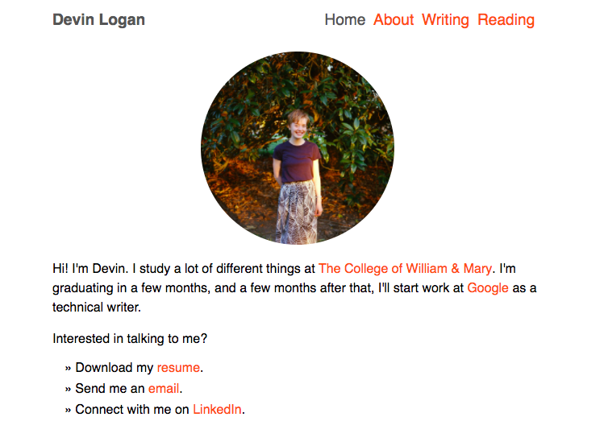

# devalog.github.io
This is my personal website! It contains my bio, resume, writing samples, and a list of stuff I've read recently. I used HTML and CSS to make this website. Ivan Echevarria's <a href="https://www.echevarria.io/">personal website</a> gave me some pointers on CSS and general design.

